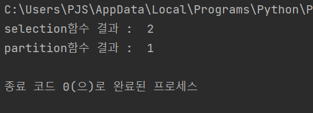
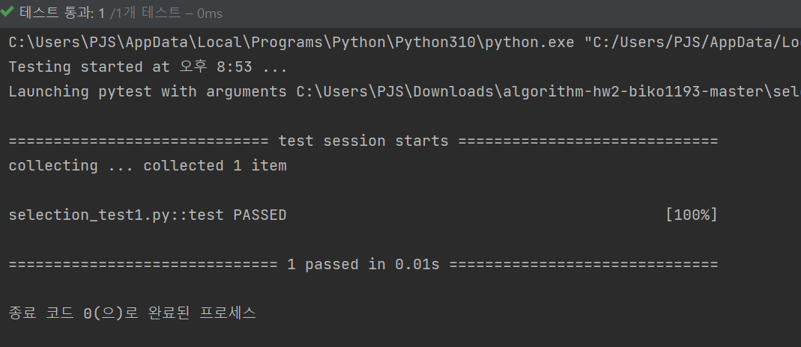
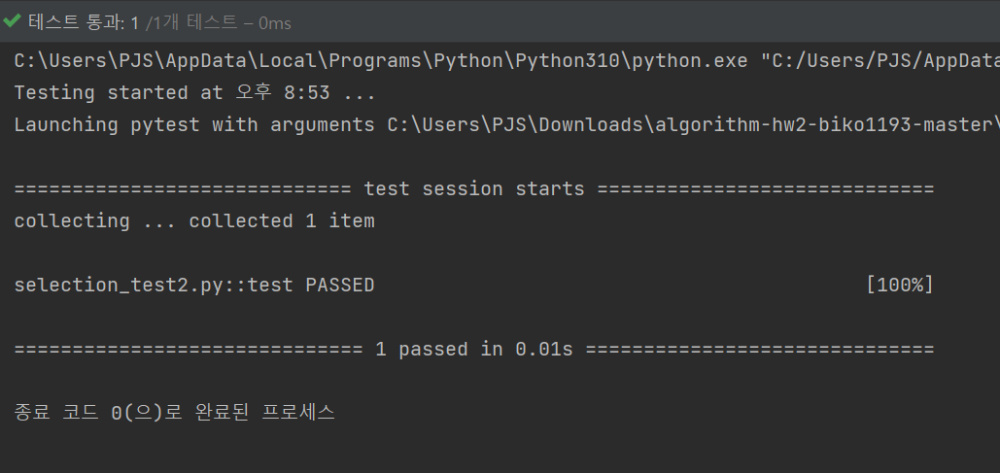
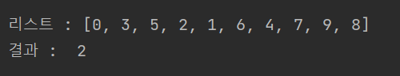
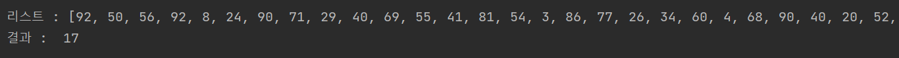

# Algorithm1 Homework2
This example project is written in Python, and tested with pytest.

### The assignment
- 리스트에서 k-번째로 작은 값을 반환하는 함수 selection()을 구현한다. 이 함수는 아래와 같이 두 개의 인자를 받는데, 첫 번째 인자 list는 숫자들의 리스트이며 두 번째 인자 k는 k-번째로 작은 원소를 반환하라는 것을 뜻한다. 여기서 가장 작은 값은 1-번째이다. 즉, k>=1 이다.

`selection(list, k)`

예를 들어, 다음을 실행하면 2를 출력한다.

`selection([1, 2, 3, 4], 2)`

- 재귀 호출 (recursive call)을 하는 경우 selection()을 다시 부른다. 여기서 구현하는 selection()은 강의에서 다룬 selection()과 인자가 다르다는 점을 주목해야 한다. 이 함수는 전체 배열에서 selection()이 담당할 시작 위치와 종료 위치를 인자로 주는 대신 리스트 자체를 주어야 한다. (힌트: 이 경우 파이썬의 슬라이스 기능이 유용하다.)
- 함수 selection()은 함수 partition()을 불러야 한다. 함수 partition()은 0-번째 원소를 pivot으로 정하고 그 왼편에는 더 작은 값들을, 오른편에는 더 큰 값들이 오도록 원소의 위치를 변경하는 함수이며, 원소들의 위치가 바뀐 후 pivot의 index를 반환한다.

`partition(list)`

예를 들어, 다음을 실행하면 1을 반환한다.

`partition([2, 1, 4, 3])`

### Setup command
`sudo -H pip3 install pytest`

### Run command
`pytest selection_test1.py`

### test1 통과

`pytest selection_test2.py`

### test2 테스트 통과

--------------
### 체크 포인트

- 길이가 10개인 리스트를 만들고 3번째로 작은 원소를 출력하도록 selection() 함수를 호출하는 코드를 작성하고 그 실행 스크린샷을 포함하시오.
    

- 랜덤 넘버 생성 함수를 이용하여 길이가 100개인 리스트를 만들고 selection() 함수를 이용하여 10번째로 작은 원소를 출력하시오. 그 실행 스크린샷을 포함하시오.
    